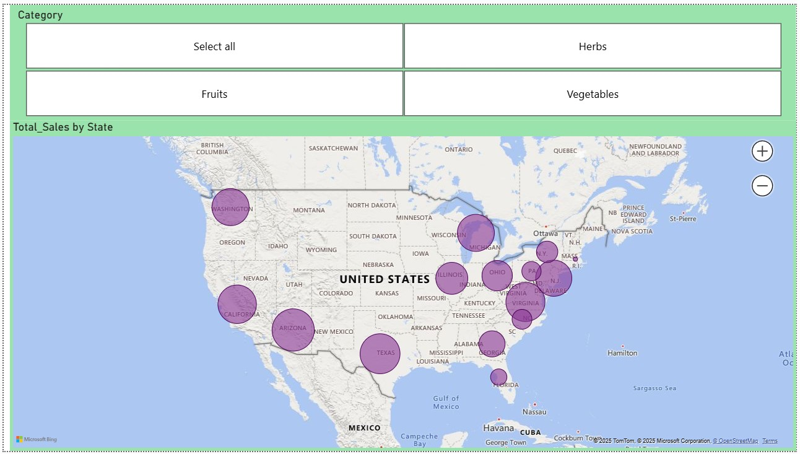

# 🌾 US Agriculture Sales - Power BI Project 🌾

## 📌 Project Overview

This Power BI project visualizes and analyzes US agriculture sales data across three main categories: Fruits, Herbs, and Vegetables. It highlights key metrics like total sales, quantity sold, profit, and profit margin while uncovering trends across months and products. It aims to help stakeholders quickly identify top-performing products, seasonal patterns, and areas for business improvement using data-driven insights.

---

## 📊 Dashboard Highlights

- **Total Sales**: $1.09M  
- **Total Quantity Sold**: 64M units  
- **Total Profit**: $338.85K  
- **Profit Margin**: 31.01%

---
## 🎯 Project Goals

- Understand seasonal trends in agriculture sales
- Identify high-performing and underperforming products
- Visualize and monitor category-wise performance
- Provide actionable insights for business optimization

---

### 💡 Key Insights:
- **Fruits** lead in total quantity sold.
- **Highest monthly sales** observed in March, July, and December.
- **Herbs like Rosemary and Tarragon** contribute high profits.
- **Profit margin** is consistently maintained around 31% across products.
- **February** shows the lowest monthly sales — a seasonal opportunity for improvement.

---
## Model View

## 🛠 Tools & Features

- **Power BI Desktop**
- Power Query for:
  - Data cleaning
  - Null value handling
  - Data type transformations
- DAX for:
  - Profit margin calculation
  - Monthly and category-based aggregation
  - Dynamic visuals
- Slicers for Year and Category filters
- Bar Charts, Line Graphs, Cards, and Table Visuals

---

## 🧠 Skills Applied

- Data Modeling
- Data Cleaning
- DAX (e.g., `CALCULATE`, `SUMX`, `DIVIDE`)
- Data Visualization Best Practices
- Business Insight Generation

---

## 📝 Overall Recommendations:
- 🌱 Invest more in high-margin products like Tomatoes, Lettuce, and Herbs (Tarragon, Oregano).
- 📈 Explore reasons for February's sales dip and address supply/seasonal gaps.
- 💬 Target marketing on fruits as they are the volume drivers.
- 🧪 Consider product bundling strategies for low-selling products with high performers.

---

## Sample Dashboard

